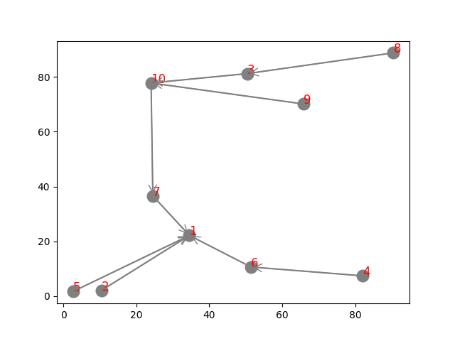
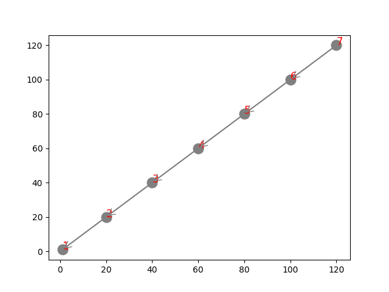
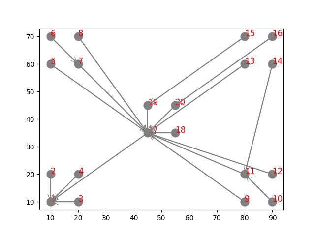
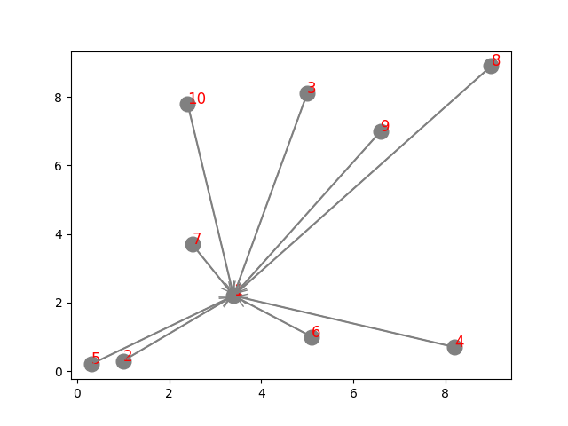

## Running Simulations

Cooja is the Contiki network simulator. Cooja allows large and small networks of Contiki motes to be simulated. Motes can be emulated at the hardware level, which is slower but allows precise inspection of the system behavior, or at a less detailed level, which is faster and allows simulation of larger networks.

Every simulation is described using a `csc` file, which is just an `xml` specification of the motes network. Every aspect of the simulation configuration can be set using the `csc` file.

Cooja provides also the possibility to write test scripts inside the configuration file. In this way it's easy to control simulation behaviour (e.g. set simulation time) and read/write files with simulation statistics. All the simulations used for this project include a test script at the bottom of the configuration file.

---

### `run_sim.sh`

This script automatically runs `n` simulations and produces a final log file with the average performance of the simulations. The command

```bash
./run_sim.sh -r -s test_sim -n 4 -c test_no_gui.csc
```

will run four different simulations (with four different random seeds) using the configuration found in the `sim/cooja/test_no_gui.csc` file. All the cooja logs and resulting files will be placed under a new `results/test_sim` folder.

> Note: you can run the script form any location inside your docker container. The csc file is assumed to be found inside `/code/sim/cooja/<name>.csc` of the docker container.

Under the hood, `run_sim.sh` calls the script `parse-stats.py` at each run. This python script reads the `test.log` output file (look at the end of `test_no_gui.csc` for an example of how this file is produced) and aggregates all results in a few summary metrics of packet delivery. It also creates `recv.csv` and `sent.csv` listing all the packets sent and received during the simulation in an easy to read format.

## RESULTS

The behaviour of the protocol can be summaries analyzing packet delivery and duty cycling statistics such as:

- **Data Collection PDR**: Packet Delivery Rate at the Sink for data collection packets
- **Source Routing PDR**: Packet Delivery Rate averaged over the nodes of the network for source routing packets
- **Average ON time**: Average time spent by the nodes with the radio turned ON.

These statistics are mainly influenced by the following configuration parameters (explanation of these parameters can be found in the [Implementation Guide](../doc/Implementation.md)):

- `TOPOLOGY_REPORT`: Active or not active
- `PIGGYBACKING`: Active or not active
- `BEACON_INTERVAL`: Time in seconds
- `BEACON_FORWARD_DELAY`: Time in seconds
- `TOPOLOGY_REPORT_HOLD_TIME`: Time in seconds
- `NETSTACK_RDC`: *contikimac\_driver* or *nullrdc\_driver*
- `NETSTACK_CONF_RDC_CHANNEL_CHECK_RATE`: 8 or 32

Thus the simulations were carried out using a combination of the possible variations of them. Also, different scenarios (number of nodes and their placement) were considered. The first results presented are produced from the `random_topology_1.csc` file, which presents the following nodes placements (The topology shown in the figure is an approximation of what happens most often towards the end of the simulations):



**NullRDC**

Using the **NulRDC** RDC layer produced obvious results: 100% of packet delivery rate both on source routing and data collection. NullRDC has been used as a testbed for the goodness of the protocol. Any decrease from a full packet delivery rate would mean some design flaw or implementation bug.

**ContikiMAC**

The simulations using the default RDC layer configuration for **ContikiMAC** (8 Hz channel check rate) were carried out under different protocol settings, as the table below shows. Every setting reports results averaged over 8-12 simulations of 30 minutes each.

| Setting | Data Collection - PDR | Source Routing - PDR | AVG Radio ON |
| :-: |:-:| :-:| :-: |
| Piggybacking + Topology Reports | 96% | 99% | ~2.1% |
| Piggybacking Only | 96% | 99% | ~2% |
| Topology Reports Only | 96% | 95% | ~2.1% |

Achieving perfect performance with a real RDC layer is almost impossible due to inevitable collisions and the overhead of the MAC protocol. Nevertheless, the results were very satisfying and almost optimal. Data collection statistics were consistent among different settings because Piggybacking and Topology Report message influence only the knowledge of the Sink about the topology, hence the routing of Source Routing packets.  
This becomes obvious looking at the Source Routing PDR for the third type of simulation (Topology Reports only). Piggybacking information inside Data Collection packets clearly helps the Sink stay in synch with the topology changes and Topology Reports alone provide less information, due to collisions or packet losses.

Working on the timings and the details of the protocol did not produce any meaningful performance improvement for the Data Collection PDR. One trick to improve the performance is to tinker with the parameters of the RDC protocol (e.g. ContikiMAC). In our case, changing the channel check rate from the default 8 Hz to 32Hz produces the following results:

| Setting | Data Collection - PDR | Source Routing - PDR | AVG Radio ON |
| :-: |:-:| :-:| :-: |
| Piggybacking + Topology Reports | 99% | 99% | ~3.3% |
| Piggybacking Only | 99% | 99% | ~3.3% |
| Topology Reports Only | 99% | 95% | ~3.3% |

---

To stress the protocol in unusual conditions and test its limits, we can try to run some simulations on strange and uncommon topologies.

The first one is a 7 nodes topology, in which the nodes are placed one after the other on a single line:



Results:

| Setting | Data Collection - PDR | Source Routing - PDR | AVG Radio ON |
| :-: |:-:| :-:| :-: |
| Piggybacking + Topology Reports (8Hz) | 96% | 97% | ~2.5% |
| Piggybacking + Topology Reports (32Hz) | 99% | 99% | ~3.4% |

The second one is a star like topology, where every point of the star is a small cluster of nodes. In this topology, the nodes that are with a cluster should have some difficulty in communicating between them (due to high collision) and this could prevent the connections between the clusters). Node 1 is the Sink node on the bottom left.

On average, the final routing tables presents the following connections:


     
Results:

| Setting | Data Collection - PDR | Source Routing - PDR | AVG Radio ON |
| :-: |:-:| :-:| :-: |
| Piggybacking + Topology Reports (8Hz) | 89% | 94% | ~3.25% |
| Piggybacking + Topology Reports (32Hz) | 99% | 99% | ~3.88% |

The last test topology is a "scaled down" version of the first one. The distance between the nodes has beed reduced by a factor of 1, in this case every node can hear and reach every other node in the topology. The resulting topology is a star topology, where every node is directly connected to the sink:



For this reason, there is little routing to be done to distribute packets. The only possible issue in delivering packets could be collisions, but simulations showed that this is not the case and the network reaches 100% in both source routing and data collection packet delivery rate, keeping a very low average on time.

---

Considering the results of the test above, the algorithm is able to provide reliable performance even under stressful conditions, even though it was designed starting from very simple rules and choices. Running many simulations using a lot of nodes is very demanding and time consuming, so other configurations and topologies were not considered in the analysis. The next step to understand the real capabilities of the protocol would be to deploy it in a real world scenario, where something aways eventually goes wrong :) 